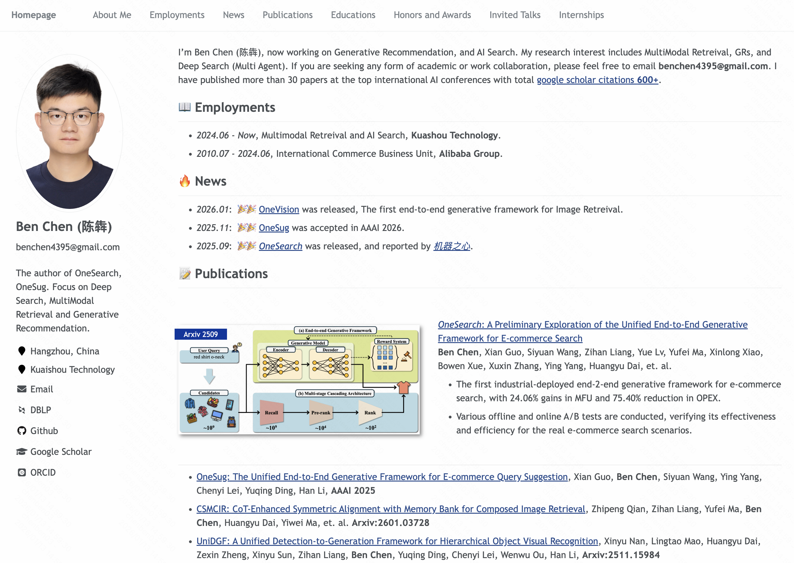

<h1 align="center">
Ben Chen HomePage
</h1>

  | [中文文档](./docs/README-zh.md) 

A Modern and Responsive Academic Personal Homepage

     
    
     

Some examples:
- HomePage: [benchen4395.github.io](https://rayeren.github.io/benchen4395.github.io/)
- Email: benchen4395@gmail.com

I’m Ben Chen (陈犇), now working on Generative Recommendation, and AI Search. 

My research interest includes MultiModal Retreival, GRs, and Deep Search (Multi Agent). 

If you are seeking any form of academic or work collaboration, please feel free to email benchen4395@gmail.com. 
